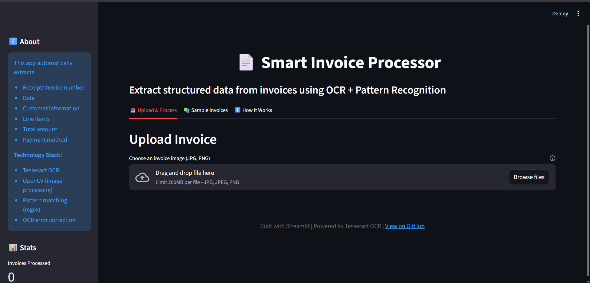
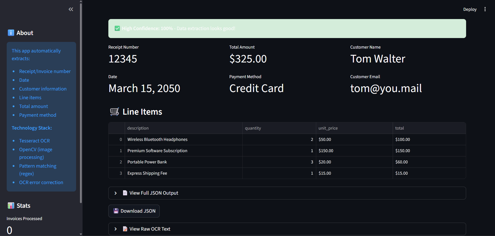
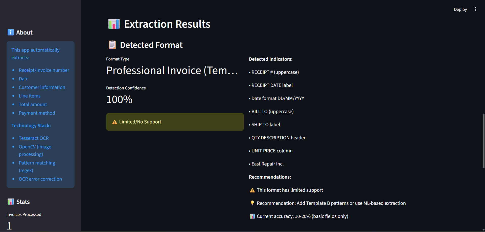

# 📄 Smart Invoice Processor

End-to-end invoice/receipt processing with OCR + Rule-based extraction and a fine‑tuned LayoutLMv3 model. Upload an image or run via CLI to get clean, structured JSON (vendor, date, totals, address, etc.).


---

## 🎯 Features

- ✅ OCR using Tesseract (configurable, fast, multi-platform)
- ✅ Rule-based extraction (regex baselines)
- ✅ ML-based extraction (LayoutLMv3 fine‑tuned on SROIE) for robust field detection
- ✅ Clean JSON output (date, total, vendor, address, receipt number*)
- ✅ Confidence and simple validation (e.g., total found among amounts)
- ✅ Streamlit web UI with method toggle (ML vs Regex)
- ✅ CLI for single/batch processing with saving to JSON
- ✅ Tests for preprocessing/OCR/pipeline

> Note: SROIE does not include invoice/receipt number labels; the ML model won’t output it unless you add labeled data. The rule-based extractor can still provide it when formats allow.

---

## 📊 Demo

### Web Interface

*Clean upload → extract flow with method selector (ML vs Regex).*

### Successful Extraction (ML-based)

*Fields extracted with LayoutLMv3.*

### Format Detection (simulated)

*UI shows simple format hints and confidence.*

### Example JSON (Rule-based)
```json
{
  "receipt_number": "PEGIV-1030765",
  "date": "15/01/2019",
  "bill_to": {
    "name": "THE PEAK QUARRY WORKS",
    "email": null
  },
  "items": [],
  "total_amount": 193.0,
  "extraction_confidence": 100,
  "validation_passed": true,
  "vendor": "OJC MARKETING SDN BHD",
  "address": "NO JALAN BAYU 4, BANDAR SERI ALAM, 81750 MASAI, JOHOR"
}
```
### Example JSON (ML-based)
```json
{
  "receipt_number": null,
  "date": "15/01/2019",
  "bill_to": null,
  "items": [],
  "total_amount": 193.0,
  "vendor": "OJC MARKETING SDN BHD",
  "address": "NO JALAN BAYU 4, BANDAR SERI ALAM, 81750 MASAI, JOHOR",
  "raw_text": "…",
  "raw_ocr_words": ["…"],
  "raw_predictions": {
    "DATE": {"text": "15/01/2019", "bbox": [[…]]},
    "TOTAL": {"text": "193.00", "bbox": [[…]]},
    "COMPANY": {"text": "OJC MARKETING SDN BHD", "bbox": [[…]]},
    "ADDRESS": {"text": "…", "bbox": [[…]]}
  }
}
```

## 🚀 Quick Start

### Prerequisites
- Python 3.10+
- Tesseract OCR
- (Optional) CUDA-capable GPU for training/inference speed

### Installation

1. Clone the repository
```bash
git clone https://github.com/GSoumyajit2005/invoice-processor-ml
cd invoice-processor-ml
```

2. Install dependencies
```bash
pip install -r requirements.txt
```

3. Install Tesseract OCR
- **Windows**: Download from [UB Mannheim](https://github.com/UB-Mannheim/tesseract/wiki)
- **Mac**: `brew install tesseract`
- **Linux**: `sudo apt install tesseract-ocr`

4. (Optional, Windows) Set Tesseract path in src/ocr.py if needed:
```bash
pytesseract.pytesseract.tesseract_cmd = r'C:\Program Files\Tesseract-OCR\tesseract.exe'
```

5. Run the web app
```bash
streamlit run app.py
```

## 💻 Usage

### Web Interface (Recommended)

The easiest way to use the processor is via the web interface.

```bash
streamlit run app.py
```
- Upload an invoice image (PNG/JPG).
- Choose extraction method in sidebar:
 - ML-Based (LayoutLMv3)
 - Rule-Based (Regex)
- View JSON, download results.

### Command-Line Interface (CLI)

You can also process invoices directly from the command line.

#### 1. Processing a Single Invoice

This command processes the provided sample invoice and prints the results to the console.

```bash
python src/pipeline.py data/samples/sample_invoice.jpg --save --method ml
# or
python src/pipeline.py data/samples/sample_invoice.jpg --save --method rules
```

#### 2. Batch Processing a Folder

The CLI can process an entire folder of images at once.

First, place your own invoice images (e.g., `my_invoice1.jpg`, `my_invoice2.png`) into the `data/raw/` folder.

Then, run the following command. It will process all images in `data/raw/`. Saved files are written to `outputs/{stem}_{method}.json`.

```bash
python src/pipeline.py data/raw --save --method ml
```

### Python API

You can integrate the pipeline directly into your own Python scripts.

```python
from src.pipeline import process_invoice
import json

result = process_invoice('data/samples/sample_invoice.jpg', method='ml')
print(json.dumps(result, indent=2))
```

## 🏗️ Architecture

```
                           ┌────────────────┐
                           │  Upload Image  │
                           └───────┬────────┘
                                   │
                                   ▼
                         ┌────────────────────┐
                         │   Preprocessing    │  (OpenCV grayscale/denoise)
                         └────────┬───────────┘
                                  │
                                  ▼
                          ┌───────────────┐
                          │     OCR       │  (Tesseract)
                          └───────┬───────┘
                                  │
                   ┌──────────────┴──────────────┐
                   │                             │
                   ▼                             ▼
         ┌──────────────────┐           ┌────────────────────────┐
         │  Rule-based IE   │           │   ML-based IE (NER)    │
         │  (regex, heur.)  │           │ LayoutLMv3 token-class │
         └────────┬─────────┘           └───────────┬────────────┘
                  │                                 │
                  └──────────────┬──────────────────┘
                                 ▼
                         ┌──────────────────┐
                         │   Post-process   │
                         │ validate, scores │
                         └────────┬─────────┘
                                  ▼
                         ┌──────────────────┐
                         │    JSON Output   │
                         └──────────────────┘
```

## 📁 Project Structure

```
invoice-processor-ml/
│
├── data/
│   ├── raw/                    # Input invoice images for processing
│   └── processed/              # (Reserved for future use)
│
│
├── data/samples/
│   └── sample_invoice.jpg      # Public sample for quick testing
│
├── docs/
│ └── screenshots/              # UI Screenshots for the README demo
│
│
├── models/
│   └── layoutlmv3-sroie-best/  # Fine-tuned model (created after training)
│
├── outputs/                    # Default folder for saved JSON results
│
├── src/
│   ├── preprocessing.py        # Image preprocessing functions (grayscale, denoise)
│   ├── ocr.py                  # Tesseract OCR integration
│   ├── extraction.py           # Regex-based information extraction logic
│   ├── ml_extraction.py        # ML-based extraction (LayoutLMv3)
│   └── pipeline.py             # Main orchestrator for the pipeline and CLI
│
│
├── tests/ # <-- ADD THIS FOLDER
│ ├── test_preprocessing.py       # Tests for the preprocessing module
│ ├── test_ocr.py                 # Tests for the OCR module
│ └── test_pipeline.py            # End-to-end pipeline tests
│
├── app.py                      # Streamlit web interface
├── requirements.txt            # Python dependencies
└── README.md                   # You are Here!
```

## 🧠 Model & Training

- **Model**: `microsoft/layoutlmv3-base` (125M params)
- **Task**:  Token Classification (NER) with 9 labels: `O, B/I-COMPANY, B/I-ADDRESS, B/I-DATE, B/I-TOTAL`
- **Dataset**: SROIE (ICDAR 2019, English retail receipts)
- **Training**: RTX 3050 6GB, PyTorch 2.x, Transformers 4.x
- **Result**: Best F1 ≈ 0.922 on validation (epoch 5 saved)

- Training scripts(local):
- `train_layoutlm.py` (data prep, training loop with validation + model save) 
- Model saved to: `models/layoutlmv3-sroie-best/`

## 📈 Performance

- **OCR accuracy (clear images)**: High with Tesseract
- **Rule-based extraction**: Strong on simple retail receipts
- **ML-based extraction (SROIE-style)**:
  - COMPANY / ADDRESS / DATE / TOTAL: High F1 on simple receipts
  - Complex business invoices: Partial extraction unless further fine-tuned

## ⚠️ Known Limitations

1. **Layout Sensitivity**: The ML model was fine‑tuned only on SROIE (retail receipts). Professional multi-column invoices may underperform until you fine‑tune on more diverse datasets.
2. **Invoice Number (ML)**: SROIE lacks invoice number labels; the ML model won’t output it unless you add labeled data. The rule-based method can still recover it on many formats.
3. **Line Items/Tables**: Not trained for table extraction yet. Rule-based supports simple totals; table extraction comes later.
4. **OCR Variability**: Tesseract outputs can vary; preprocessing and thresholds can impact ML results.

## 🔮 Future Enhancements

- [ ] Add and fine‑tune on mychen76/invoices-and-receipts_ocr_v1 (English) for broader invoice formats
- [ ] (Optional) Add FATURA (table-focused) for line-item extraction
- [ ] Sliding-window chunking for >512 token documents (to avoid truncation)
- [ ] Table detection (Camelot/Tabula/DeepDeSRT) for line items
- [ ] PDF support (pdf2image) for multipage invoices
- [ ] FastAPI backend + Docker
- [ ] Multilingual OCR (PaddleOCR) and multilingual fine‑tuning
- [ ] Confidence calibration and better validation rules

## 🛠️ Tech Stack

| Component | Technology |
|-----------|------------|
| OCR | Tesseract 5.0+ |
| Image Processing | OpenCV, Pillow |
| ML/NLP | PyTorch 2.x, Transformers |
| Model | LayoutLMv3 (token class.) |
| Web Interface | Streamlit |
| Data Format | JSON |

## 📚 What I Learned

- OCR challenges (confusable characters, confidence-based filtering)
- Layout-aware NER with LayoutLMv3 (text + bbox + pixels)
- Data normalization (bbox to 0–1000 scale)
- End-to-end pipelines (UI + CLI + JSON output)
- When regex is enough vs when ML is needed
- Evaluation (seqeval F1 for NER)

## 🤝 Contributing

Contributions welcome! Areas needing improvement:
- New patterns for regex extractor
- Better preprocessing for OCR
- New datasets and training configs
- Tests and CI

## 📝 License

MIT License - See LICENSE file for details

## 👨‍💻 Author

**Soumyajit Ghosh** - 3rd Year BTech Student
- Exploring AI/ML and practical applications
- [LinkedIn](https://www.linkedin.com/in/soumyajit-ghosh-49a5b02b2?utm_source=share&utm_campaign) | [GitHub](https://github.com/GSoumyajit2005) | [Portfolio](#)(Coming Soon)

---

**Note**: "This is a learning project demonstrating an end-to-end ML pipeline. Not recommended for production use without further validation, retraining on diverse datasets, and security hardening."